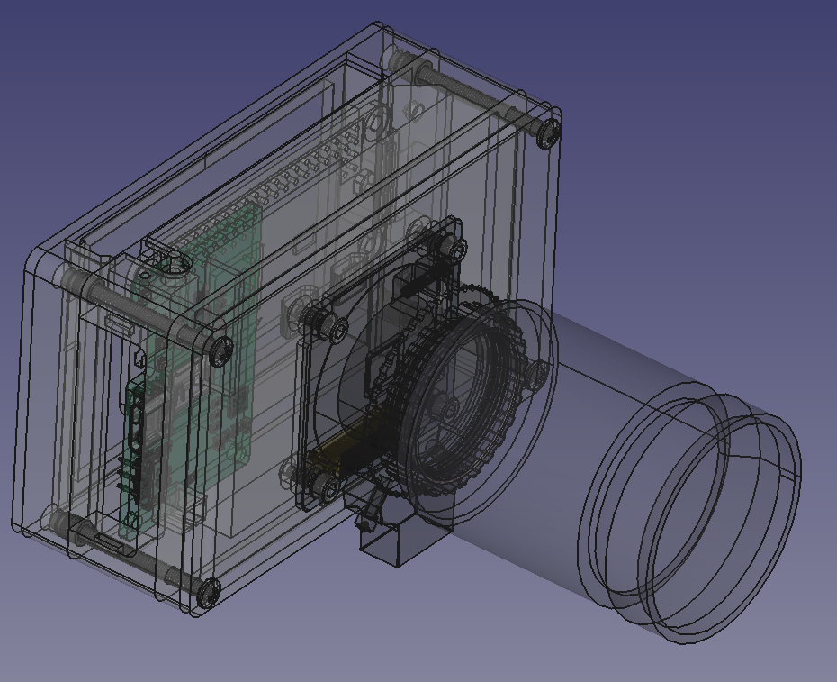

tinycam
---

This is a simple point-and-shoot camera, mostly an excuse to play with the new [Raspberry Pi High Quality camera](https://www.raspberrypi.org/products/raspberry-pi-high-quality-camera/) and ~~maybe~~ **also** a simple PCB for battery management.
The code is a very simple python script wrapping `raspistill`.
CAD is in [FreeCAD](https://www.freecadweb.org/), and any PCBs designed will be [KiCAD](https://kicad-pcb.org/).

Hardware requirements:

- [Raspberry Pi Zero W ($25)](https://www.amazon.com/CanaKit-Raspberry-Wireless-Official-Supply/dp/B071L2ZQZX/)
- [Samsung Evo+ 32 GB microSD card ($9)](https://www.amazon.com/gp/product/B00WR4IJBE)
- [iUniker 2.8" display ($23)](https://www.amazon.com/gp/product/B07H8ZY89H/)
- [Raspberry Pi High Quality camera ($50)](https://www.pishop.us/product/raspberry-pi-hq-camera/?src=raspberrypi)
- [Telephoto lens for HQ camera ($63)](https://www.pishop.us/product/16mm-telephoto-lens-for-raspberry-pi-hq-camera/)
- [Adafruit PowerBoost 1000 Charger ($20)](https://www.adafruit.com/product/2465)
- [tinycam PCB (~$35 to build)](pcb/)

#### next TODO:

- v2 of chassis to support button trigger and battery management
- auto upload to gphotos a la [eshmu/gphotos-upload](https://github.com/eshmu/gphotos-upload)
- support sleep / wake mode
- gallery mode (for local delete)

#### maybe later TODO:

- support video capture mode
- Qt overlay on top of preview for mode switching or adjusting 'manual' controls
