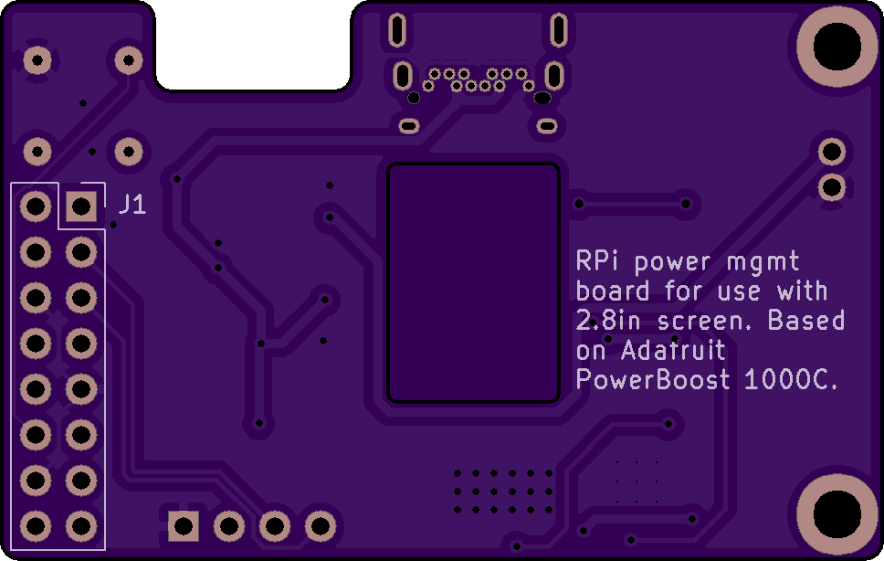

PCB
---

PCB designed in KiCAD, BOM in DigiKey importable format ([pcb.csv](pcb.csv)).
The PCB is [shared on OSHPark](https://oshpark.com/shared_projects/RB1etkN8), cost is $11.90 for 3x board with normal prototyping service.

### 3D Model:

### Schematic:

### PCB Front:

### PCB Back:

